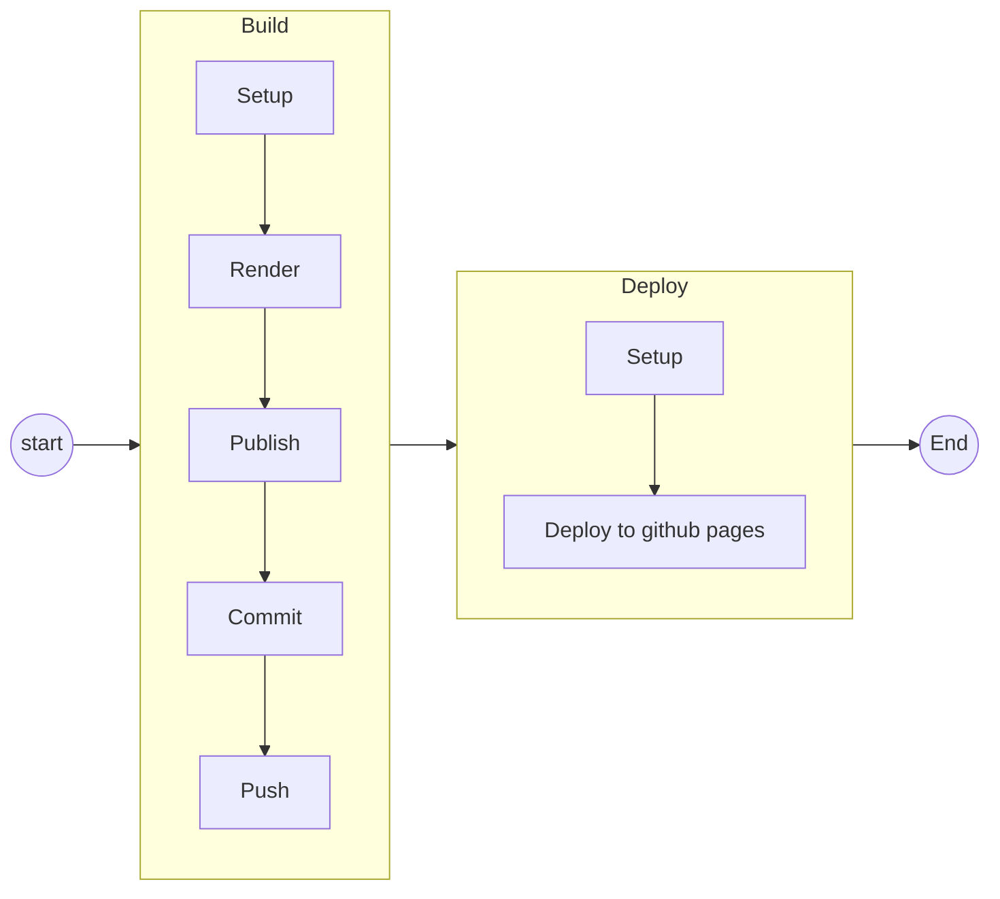

# Readme

```mermaid
flowchart LR
    id0((start)) --> Build
    Build --> Deploy
    Deploy --> id00((End))
    subgraph Build
        direction TB
        id1[Setup] --> id2[Render]
        id2 --> id3[Publish] 
        id3 --> id4[Commit]
        id4 --> id5[Push]
    end
    subgraph Deploy
        direction TB
        id6[Setup] --> id7[Deploy to github pages]
    end

```