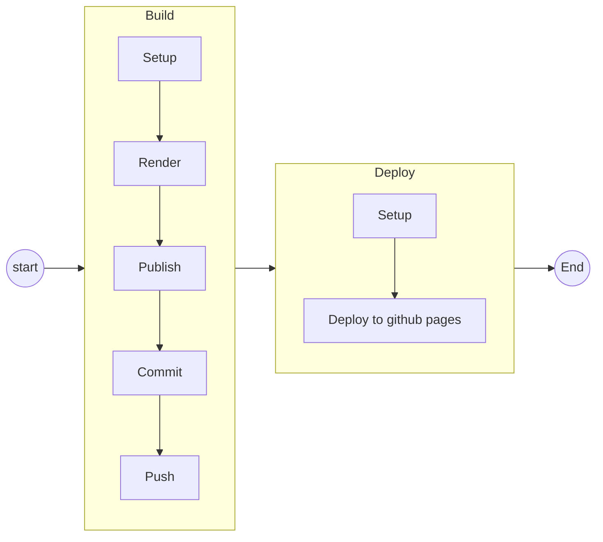

# Readme

# Important

You need to enable an option in the project settings to make this work.

[here](https://www.raulmelo.me/en/til/how-to-solve-permission-to-x-denied-to-github-actions-bot#:~:text=Permission%20to%20%22x%22%20denied%20to,option%20Read%20and%20write%20permissions.)